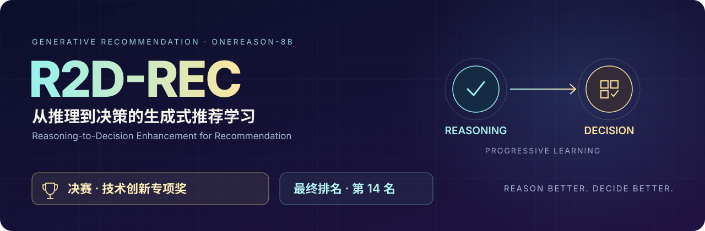
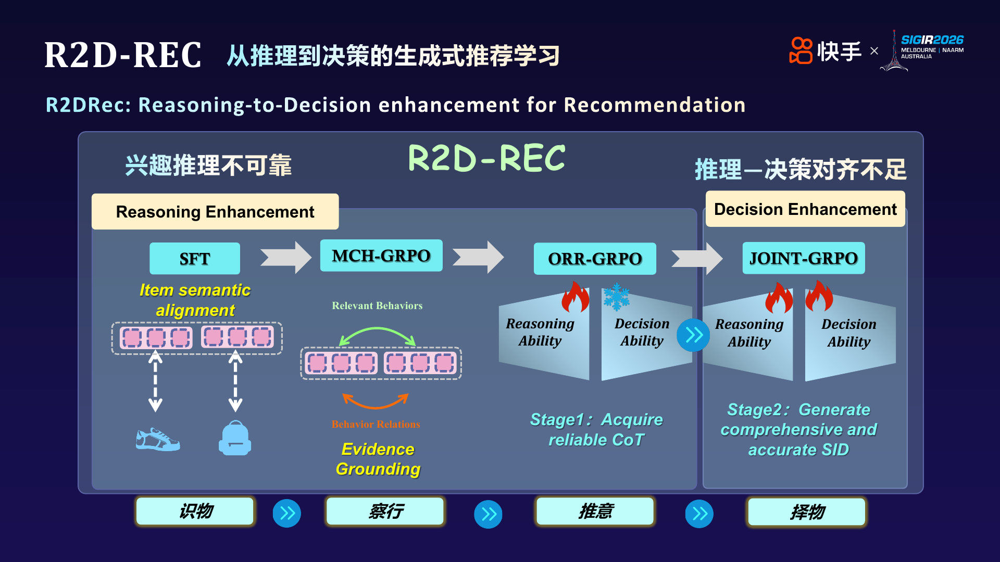
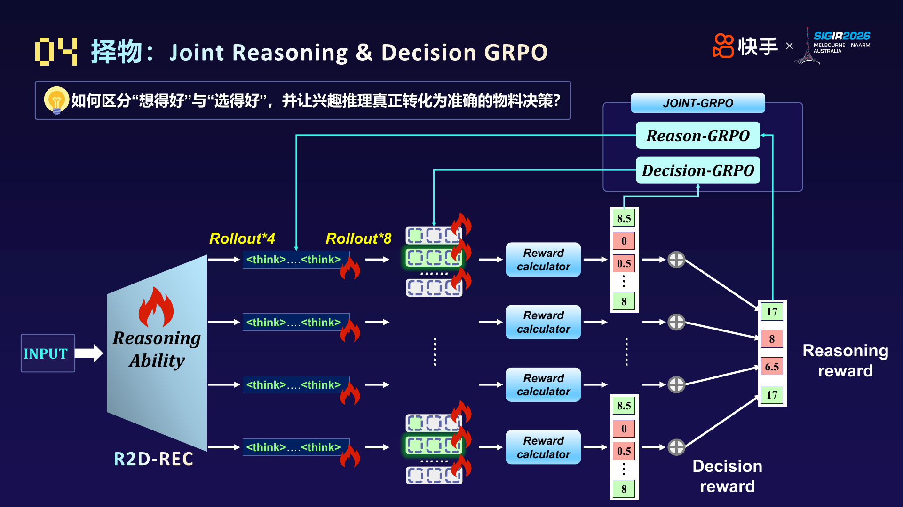

<p align="center">
  
</p>

<p align="center">
  <strong>🏆 决赛「技术创新专项奖」 &nbsp; · &nbsp; 最终排名第 14 名</strong>
</p>

<p align="center">
  <a href="#progressive-learning">方案特色</a> ·
  <a href="#methods">方法与架构</a> ·
  <a href="#final-result">最终结果</a> ·
  <a href="#explorations">探索 Tricks</a> ·
  <a href="docs/r2d-rec/REPRODUCTION.md">复现指南</a> ·
  <a href="docs/README.md">项目文档</a>
</p>

# R2D-REC：从推理到决策的生成式推荐学习

**Reasoning-to-Decision Enhancement for Recommendation**

**先学会基于证据推理，再学会把推理转化为准确的推荐决策。**

R2D-REC 基于 OneReason-8B，将生成式推荐中的“理解物料、定位行为、归纳兴趣、生成 SID”组织为渐进式学习过程。我们关注两个相互关联的问题：兴趣推理是否可靠，以及可靠推理能否转化为全面、准确的推荐候选。

<a id="progressive-learning"></a>

## 方案特色：Reasoning → Decision

我们的核心思路是**先增强推理能力，再推进推理与决策的联合优化**。前一阶段为后一阶段建立可用的语义与证据基础；后一阶段进一步学习如何利用这些信息完成 SID 选择。

| 学习阶段 | 关键动作 | 希望建立的能力 |
| --- | --- | --- |
| 语义与证据基础 | Semantic Alignment SFT 对齐物料语义；MCH-GRPO 定位主题相关行为及其关系 | 理解 SID 的含义，并从长历史中找到可信依据 |
| **Reasoning Enhancement** | ORR-GRPO 用 CoT 后的推荐结果评价推理，把候选命中反馈传回推理过程 | 生成对推荐结果有帮助的 CoT |
| **Decision Enhancement** | Joint-GRPO 在已有推理基础上，对 CoT 与其后的 SID 动作分别分配信用、联合更新 | 将兴趣推理转化为准确且有覆盖性的候选 |



*最终答辩整体方案图。图中的训练标记表示各阶段训练信号的组织；实际路由、参数共享和 checkpoint 继承关系见[方法映射](docs/r2d-rec/METHODS.md)与[复现指南](docs/r2d-rec/REPRODUCTION.md)。*

这一设计有三个重点：

- **让推理有依据。** 物料语义对齐与行为边际信用共同提供支撑，减少偶然属性和无关历史对兴趣判断的干扰。
- **让推理接受结果检验。** 用后续推荐候选的命中情况评价 CoT，使训练信号直接关联推荐目标。
- **区分推理信用与决策信用。** 在 Joint 阶段，先采样 CoT，再为每条 CoT 独立采样 SID，分别构造训练信号。该阶段继续优化推理，并同时学习答案动作。

<a id="methods"></a>

## 四个方法模块

| 模块 | 核心方法 | 代码与说明 |
| --- | --- | --- |
| **识物 · Semantic Alignment SFT** | 聚合同一 SID 的稳定共享语义，结合 canonical / reverse 表达建立语义基础 | [语义对齐](docs/r2d-rec/METHODS.md#semantic-alignment-sft) |
| **察行 · MCH-GRPO** | 结合全局结果信号与行为单元的边际信用，定位相关行为和关系 | [边际信用混合目标](docs/r2d-rec/METHODS.md#mch-grpo) |
| **推意 · ORR-GRPO** | 以 CoT 后的 Beam32 推荐结果评价推理，提供分层结果反馈 | [结果驱动推理](docs/r2d-rec/METHODS.md#orr-grpo) |
| **择物 · Joint-GRPO** | 对 CoT 与独立采样的 SID 分别分配信用，联合优化推理和决策 | [联合优化](docs/r2d-rec/METHODS.md#joint-grpo) |



*最终答辩 Joint-GRPO 机制图。示意奖励数值用于解释信用分配，并非组件评测成绩。图示与代码入口见[图片来源说明](assets/r2d-rec/README.md)。*

上述顺序描述方案的能力组织逻辑。仓库保留不同时间、不同 parent 的实验，历史训练顺序以各版本配置和 lineage 为准；例如 `GR_REC_v1` 同时包含 Think / NoThink 路由，Joint 的双目标实现位于 `GRPO-TK / GR_REC_ThinkSample8_FullSID_v3`。

<a id="final-result"></a>

## 最终结果与竞赛荣誉

**决赛获得「技术创新专项奖」，最终排名第 14 名。**

| 模型 | 懂物料 | 懂用户 | 懂推荐 | 懂世界 | 总分 |
| --- | ---: | ---: | ---: | ---: | ---: |
| **R2D-REC 最终模型** | **0.1818** | **0.2572** | **0.6892** | **0.2357** | **1.3639** |

以上为最终答辩采用的一次外部评测结果。首页仅展示最终选中模型成绩；模型身份、评测口径和原始记录见[最终结果说明](docs/r2d-rec/FINAL_RESULT.md)。

<a id="explorations"></a>

## 剩余探索 Tricks

除最终方案外，仓库还保留以下独立探索。**实现、训练完成与收益验证是不同状态**；这些方案不自动加入默认复现链，也不代表都参与了最终模型。详细机制、源码和证据见[探索清单](docs/r2d-rec/EXPLORATIONS.md)。

| 方向 | 主要想法 | 当前证据 |
| --- | --- | --- |
| 兴趣覆盖复合奖励 | 将 CoT 兴趣覆盖/质量与推荐结果结合 | 固定域短程验证通过，最终收益待验证 |
| SID 逐层信用分配 | A/B/C 分别构造优势，按前缀正确性分配信用 | CPU 实现，未正式 GPU 训练 |
| DSR 稀疏奖励补救 | 为低信号或全零奖励组补充训练信号 | Pilot 完成，收益证据不足 |
| Exact-Clamp | 避免完整命中候选收到负优势 | 最新版本仅 CPU 验证 |
| 历史复制惩罚课程 | 对历史内候选采用阶段化奖励折扣 | 已实现，未正式训练 |
| 双接口 SID 优化 | 同时覆盖自由生成与官方固定前缀 | Code-only |
| Frontier 首错归因 | 将惩罚定位到 SID 首个错误层级 | 完整训练完成，观察到跨路干扰 |
| Bridge-Inside 边界适配 | 将自然语言 Bridge 移到 think 结束前 | 已有实现，收益待验证 |
| Bridge-to-Bare 蒸馏 | 按 SID token family 迁移带 Bridge 的分布 | 已实验，未解决目标接口差距 |
| 重复 CoT 降权 | 按组归一重复推理文本的监督权重 | 已训练，外部表现未同步改善 |
| Action 历史 Trie 与长度约束 | 抑制非法 SID、重复和提前停止 | 已有实现与验证入口 |
| GradNorm-lite / 局部 LoRA 投影 | 平衡任务梯度并缓解冲突 | 已有实验，未确立收益 |
| Positive A0 | 降低只命中粗粒度前缀的奖励 | 已实现，缺正式实验 |
| 固定 CoT 交叉诊断 | 分离推理、解码排序与 Bridge 接口影响 | 已有诊断与记录 |

Bridge 的候选重构与潜在正则化是这些探索的重要研究背景，相关观察和假设见 [Bridge 研究入口](docs/r2d-rec/METHODS.md#bridge)。

## 复现与项目导航

复现前固定 base、adapter、数据版本、采样配置与训练环境，再选择对应版本入口。

| 目的 | 入口 |
| --- | --- |
| 了解方法、源码和术语 | [方法与代码映射](docs/r2d-rec/METHODS.md) |
| 查阅实际训练顺序与模型继承 | [复现指南](docs/r2d-rec/REPRODUCTION.md) |
| 运行历史四阶段 adapter 链 | [历史复现入口](reproduction/final_chain_20260901/README.md) |
| 查阅后续全参数 SFT 路线 | [Rec FDR V4.3 strict-deterministic](reproduction/rec_fdr_v43_strictdet/README.md) |
| 查阅 CoT G4 + 独立 FullSID G8 的双目标实现 | [GRPO-TK 指南](docs/reproduce_GRPO_TK.md) |
| 查找工程、历史和上游框架文档 | [文档总览](docs/README.md) · [目录索引](docs/r2d-rec/REPOSITORY_MAP.md) |

```bash
git clone https://github.com/reyuyu/R2D-REC.git
cd R2D-REC
```

## 数据与许可证

仓库存放代码、配置、测试及可审计的结果摘要。训练数据、模型权重、tokenized cache 和运行凭据使用外部存储，按各复现入口的数据合同准备。

训练框架基于 LLaMA-Factory，沿用 [Apache-2.0 许可证](LICENSE)，上游[说明](docs/upstream/LLAMA_FACTORY_ZH.md)与[引用信息](docs/upstream/LLAMA_FACTORY.cff)单独保留；基础模型及竞赛数据遵守各自许可证和赛事要求。
