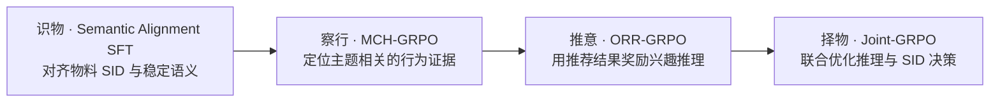

# R2D-REC：从推理到决策的生成式推荐学习

**Reasoning-to-Decision Enhancement for Recommendation**

R2D-REC 基于 OneReason-8B，围绕生成式推荐的两个问题展开：**兴趣推理是否可靠，以及推理能否转化为准确的推荐决策。** 项目通过物料语义对齐、行为证据定位、结果奖励驱动的推理优化，以及推理与决策的联合优化，连接“理解物料、理解用户、形成兴趣推理、生成推荐 SID”四种能力。

本页按最终答辩的逻辑介绍方案。代码继续使用已有工程名称；[方法与代码映射](docs/r2d-rec/METHODS.md)说明每个模块的对应实现，[复现指南](docs/r2d-rec/REPRODUCTION.md)说明实际 checkpoint 继承顺序。

## 方案总览

上图表示答辩中的能力组织逻辑。历史复现实验的阶段顺序由各自配置和 parent 合同定义，见[复现入口与模型来源](docs/r2d-rec/REPRODUCTION.md)。

| 模块 | 解决的问题 | 核心方法 | 阅读入口 |
| --- | --- | --- | --- |
| **识物：Semantic Alignment SFT** | 同一 SID 的多条描述含偶然属性，容易造成语义对齐偏差 | 聚合物料共享语义，结合 canonical / reverse 表达建立多任务 SFT 基础 | [语义对齐](docs/r2d-rec/METHODS.md#semantic-alignment-sft) |
| **察行：MCH-GRPO** | 长历史中的无关行为干扰兴趣推理，序列奖励难以定位具体行为的贡献 | 结合全局结果信号与行为单元的边际信用，优化相关行为及其关系的提取 | [边际信用混合目标](docs/r2d-rec/METHODS.md#mch-grpo) |
| **推意：ORR-GRPO** | 推理文字合理，不代表能支持准确推荐；结果奖励可能稀疏 | 以 CoT 后的 Beam32 推荐结果评价推理，对不同正确程度提供分层反馈 | [结果驱动推理](docs/r2d-rec/METHODS.md#orr-grpo) |
| **择物：Joint-GRPO** | 高质量 CoT 与准确 SID 生成之间仍存在差距 | 对 CoT 与其后独立采样的 SID 分别分配信用，联合优化两个动作阶段 | [推理与决策联合优化](docs/r2d-rec/METHODS.md#joint-grpo) |

## 最终结果

只展示最终选中模型的结果；本页不展开各组件的中间成绩或消融表。

| 模型 | 懂物料 | 懂用户 | 懂推荐 | 懂世界 | 总分 |
| --- | ---: | ---: | ---: | ---: | ---: |
| **R2D-REC 最终模型** | **0.1818** | **0.2572** | **0.6892** | **0.2357** | **1.3639** |

这是最终答辩采用的一次外部评测结果，可与仓库已有的原始记录核对，不表示多次评测均值或跨环境复现保证。模型身份、评测口径及来源见[最终结果说明](docs/r2d-rec/FINAL_RESULT.md)。

## 从哪里开始

| 目的 | 入口 |
| --- | --- |
| 了解方案、术语与阅读顺序 | [R2D-REC 文档导航](docs/r2d-rec/README.md) |
| 找到四个模块的 runner、loss、reward 和配置 | [方法与代码映射](docs/r2d-rec/METHODS.md) |
| 选择历史 adapter 链或后续全参数 SFT 复现路线 | [复现指南](docs/r2d-rec/REPRODUCTION.md) |
| 了解代码、数据合同、监控、历史实验的位置 | [仓库目录索引](docs/r2d-rec/REPOSITORY_MAP.md) |
| 核对最终模型成绩 | [最终结果说明](docs/r2d-rec/FINAL_RESULT.md) |

## 关于复现

仓库保留了不同时间、不同 parent 的实验。**方法名称、历史实验代号和训练阶段编号并非一一对应**：例如 Joint-GRPO 的相关双目标实现叫作 `GRPO-TK / GR_REC_ThinkSample8_FullSID_v3`，而 `GR_REC_v1` 同时包含 Think 和 NoThink 路由。

复现前应固定 base、adapter、数据版本、采样配置与训练环境，再选择对应入口：

- [历史四阶段 adapter 链](reproduction/final_chain_20260901/README.md)：保存选中 checkpoints 的实际继承关系。
- [Rec FDR V4.3 全参数 SFT](reproduction/rec_fdr_v43_strictdet/README.md)：另一条独立的确定性复现路线，输出为完整模型。
- [GRPO-TK 复现指南](docs/reproduce_GRPO_TK.md)：CoT G4 与每条 CoT 后独立 FullSID G8 的双目标实现。

此轮整理仅更新项目介绍与文档导航，训练实现、数据、已有配置和 checkpoint 选择合同保持原样。

## 探索：推理与答案之间的 Bridge

训练数据中的自然语言 Bridge 与评测时直接给定域前缀的接口差异，可能改变 Beam32 候选分布。项目保留了相关边界诊断与对照实验，作为理解模型行为的研究线索；它不是默认训练链中的额外阶段。见[Bridge 研究入口](docs/r2d-rec/METHODS.md#bridge)。

## 数据与许可证

本仓库用于存放代码、配置、测试及可审计的结果摘要。训练数据、模型权重、tokenized cache 和运行凭据使用外部存储，按各复现入口的数据合同准备。

训练框架基于 LLaMA-Factory，沿用 [Apache-2.0 许可证](LICENSE)；基础模型及竞赛数据遵守各自许可证和赛事要求。
